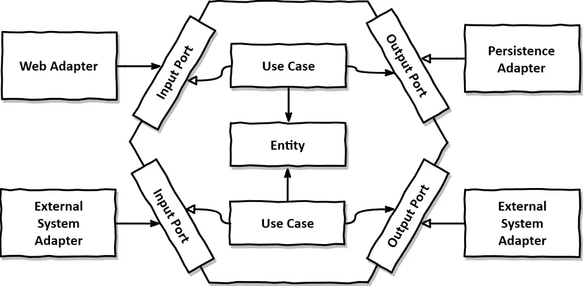

# **Java Project Architecture Template**

<p align="center">
  
</p>

Here you will describe this project, what it does, and its goals, making it clear to everyone. Example:

The **Java Architecture Template** is a project designed to serve as a template for creating applications, aiming for development with exceptional 
technical quality to ensure long-term maintainability. 
In this template, we provide a user registration endpoint that triggers an event in the broker when a user is registered. A listener will receive these creation events and enrich them with address data.

📖 Read this in:
- 🇧🇷 [Português](README.pt.md)


## **Architecture**

This project follows the **Hexagonal Architecture**, as proposed by Alistair Cockburn, focuses on **decoupling the application’s core business logic from its input and output
mechanisms**. This design principle promotes adaptability, testability, and sustainability by encapsulating the application layer (business core) and
exposing defined ports for interactions with external systems.

<p align="center">
    
</p>

### **Core Concept**

The architecture isolates the core domain logic by structuring the application into distinct layers:

- **Adapters Layer**: Handles communication with external systems (e.g., databases, APIs, or user interfaces). Divided into:
    - **Input Adapters**: Handle requests coming into the application, such as HTTP requests or events.
    - **Output Adapters**: Implement communication with external systems like repositories or external services.

- **Core Layer**: Represents the heart of the application:
    - **Domain**: Contains the core business entities, value objects, and aggregates.
    - **Use Cases**: Encapsulates application workflows and orchestrates interactions between domain objects and ports.
    - **Ports**: Defines interfaces for input and output interactions, ensuring the core remains framework-agnostic.

_Read more about: [O Core Domain: Modelando Domínios Ricos](https://medium.com/inside-picpay/o-core-domain-modelando-dom%C3%ADnios-ricos-f1fe664c998f)
and [O Use Case: Modelando as Interações do Seu Domínio](https://medium.com/inside-picpay/o-use-case-modelando-as-intera%C3%A7%C3%B5es-do-seu-dom%C3%ADnio-c6c568270d0c)_

### **Project Structure**

The structure adheres to the principles of Hexagonal Architecture, as demonstrated below:

```plaintext
application
    br.com.helpdev.sample
    ├── adapters
    │   ├── input         # Controllers, event listeners, or other entry points
    │   ├── output        # Database repositories, external API clients, etc.
    ├── config            # Configuration files and application settings
    ├── core              # Core business logic
    │   ├── ports
    │   │   ├── input     # Interfaces defining input interactions (e.g., commands, queries)
    │   │   ├── output    # Interfaces defining output interactions (e.g., persistence, external APIs)
    │   ├── domain        # Entities, value objects, and aggregates
    │   ├── usecases      # Application-specific business workflows
    
acceptance-test
    # Integration tests with real Docker application.
```

### **Architecture Tests**

This architecture is warranted by [**ArchUnit tests**](application/src/test/java/br/com/helpdev/sample/ArchitectureTest.java) to ensure the project's
compliance with the defined structure.
These tests validate the project's adherence to the Hexagonal Architecture principles,
guaranteeing the separation of concerns and the independence of the core business logic from external systems.

_Read more about: [Garantindo a arquitetura de uma aplicação sem complexidade](https://medium.com/luizalabs/garantindo-a-arquitetura-de-uma-aplica%C3%A7%C3%A3o-sem-complexidade-6f675653799c)_


### **Acceptance Tests**

To ensure robust testing, the **acceptance-test** module encapsulates the application within a Docker image and executes integration tests in an
environment that closely mimics the real-world behavior of the application. This approach guarantees homogeneity in the application modules by
restricting unit tests to the main application module, while handling integration tests separately within the acceptance-test module.

This separation ensures:

1. **Realistic Test Environments**: Integration tests are performed in conditions resembling the actual runtime environment, improving test
   reliability.

2. **Clear Test Scope**: Unit tests focus solely on isolated components within the core application, while integration tests validate end-to-end
   workflows and external interactions.

3. **Ease of Deployment**: Encapsulation in Docker allows seamless deployment and execution of tests across different environments.

By adhering to this strategy, the acceptance-test module becomes an essential part of maintaining the integrity and reliability of the application
during its lifecycle. View module [README](acceptance-test/README.md).

_Read more about: [Separando os testes integrados de sua aplicação em um novo conceito](https://medium.com/luizalabs/separando-os-testes-integrados-de-sua-aplica%C3%A7%C3%A3o-em-um-novo-conceito-4f511ebb53a4)_


## **Getting Started**

This project provides a complete local stack with all the dependencies necessary to run the application. Additionally, an observability environment
using **OpenTelemetry** and **Grafana** is included.

### **Prerequisites**

Ensure you have the following tools installed on your machine:

- **Docker**: [Install Docker](https://docs.docker.com/get-docker/)
- **Docker Compose**: [Install Docker Compose](https://docs.docker.com/compose/install/)
- **Java 21**: [Download Java 21](https://www.oracle.com/java/technologies/javase/jdk21-archive-downloads.html)

_Note: Maven was embedded in the project to avoid the need to install it on your machine._

### **Running the Project**

For a seamless development experience, the project includes a Makefile with predefined commands to simplify common tasks. These commands encapsulate

1. **Run Tests**:
    - `make run-unit-tests`: Runs unit tests for the application.
    - `make run-acceptance-tests`: Executes acceptance tests using Docker.
    - `make run-all-tests`: Executes all tests, including unit and **integration tests**.

2. **Run Application**:
    - `make mvn-run`: Runs the application with Spring Boot using the `local` profile.

3. **Run Infrastructure**:
    - `make run-infrastructure`: Starts infrastructure services using Docker Compose.
    - `make run-observability`: Starts observability services (OpenTelemetry, Grafana).
    - `make run-stack`: Starts both infrastructure and observability services.

4. **Run Entire Application**:
    - `make run-app`: Starts the application services.
    - `make run-all`: Starts the entire stack (infrastructure, observability, and application).

5. **Stop Services**:
    - `make stop-infra`: Stops infrastructure services.
    - `make stop-observability`: Stops observability services.
    - `make stop-stack`: Stops both infrastructure and observability services.
    - `make stop-app`: Stops the application services.
    - `make stop-all`: Stops all running services (infrastructure, observability, and application).

This setup ensures an efficient and consistent development experience, enabling seamless integration and monitoring capabilities in a local
environment.

### **The Flyway Database Migration Tool**

To ensure better startup performance and avoid concurrency issues in Kubernetes environments, **Flyway** has been implemented as a decoupled database
migration tool. This design enables the migration process to run independently of the application.

Key Features:

- **Pre-deployment Execution**: Migration scripts and the Flyway command are included within a Docker image, allowing them to be executed as a
  pre-hook during Kubernetes deployments or using other orchestration strategies.
- **Avoiding Contention**: By decoupling migrations from the application startup, potential race conditions or resource bottlenecks are mitigated.
- **Consistency Across Environments**: Ensures all database migrations are applied before the application is deployed, maintaining consistency.

This approach enhances deployment reliability and maintains a clean separation of concerns, aligning with the project's architectural principles.

You see the sample how to execute in: [application docker-compose file](.docker-compose-local/application/docker-compose.yml).

### **OpenAPI**
This project uses **Springdoc OpenAPI** to automatically document REST endpoints.

🔗 [Official OpenAPI site](https://swagger.io/specification/)

#### How to access OpenAPI documentation
After starting the application, access:

- **Swagger UI**: [http://localhost:8080/swagger-ui.html](http://localhost:8080/swagger-ui.html)
- **OpenAPI specification in JSON**: [http://localhost:8080/v3/api-docs](http://localhost:8080/v3/api-docs)

### **AsyncAPI**
This project uses **Springwolf** to document asynchronous events (Kafka, RabbitMQ, etc.) with **AsyncAPI**.

🔗 [Official AsyncAPI site](https://www.asyncapi.com/)

#### How to access AsyncAPI documentation
After starting the application, access:

- **AsyncAPI UI**: [http://localhost:8080/springwolf/asyncapi-ui.html](http://localhost:8080/springwolf/asyncapi-ui.html)
- **AsyncAPI specification in JSON**: [http://localhost:8080/springwolf/docs](http://localhost:8080/springwolf/docs)

### **Available Infrastructure**

The local stack also includes infrastructure services to support the application. These services are accessible on `localhost` and provide essential
functionalities:

- **Grafana**: Visualization and monitoring dashboard, available at [http://localhost:3000](http://localhost:3000).
- **Prometheus**: Metrics collection and monitoring system, available at [http://localhost:9090](http://localhost:9090).
- **Jaeger**: Distributed tracing system, available at [http://localhost:16686](http://localhost:16686).
- **MySQL**: Relational database system, accessible at `localhost:3306`.
- **Kafka**: Event streaming platform, available at `localhost:9092`.

These services are orchestrated using Docker Compose to ensure seamless setup and operation in a local development environment.


## **Architectural Decision Records (ADR)**

The project includes a dedicated folder for **Architectural Decision Records (ADR)**, located in the `adr` directory. This folder documents key
architectural decisions made throughout the project, providing context, rationale, and implications for these choices.

To learn more about the ADRs and explore the documented decisions, refer to the [ADR README](./adr/README.md).


## **Contribute**

Pull Requests are welcome. For significant changes, please open an issue first to discuss what you would like to change. Make sure to update tests as
appropriate.


_**Architecture Template Project proposed by Guilherme Biff Zarelli**_

- **Blog/Site**: [https://helpdev.com.br](https://helpdev.com.br)
- **LinkedIn**: [https://linkedin.com/in/gbzarelli/](https://linkedin.com/in/gbzarelli/)
- **GitHub**: [https://github.com/gbzarelli](https://github.com/gbzarelli)
- **Articles in Medium**: [https://medium.com/@guilherme.zarelli](https://medium.com/@guilherme.zarelli)
- **Email**: [gbzarelli@helpdev.com.br](mailto:gbzarelli@helpdev.com.br)

_Good software design, as Robert C. Martin emphasizes in his book *Clean Architecture: A Craftsman's Guide to Software Structure and Design*, aims to *
*minimize the human resources required to build and maintain a system**. This project template draws inspiration from real-world challenges and experiences,
providing a comprehensive perspective on building durable, maintainable architectures._

> *"The only way to go fast, is to go well."*  
> – **Robert C. Martin**