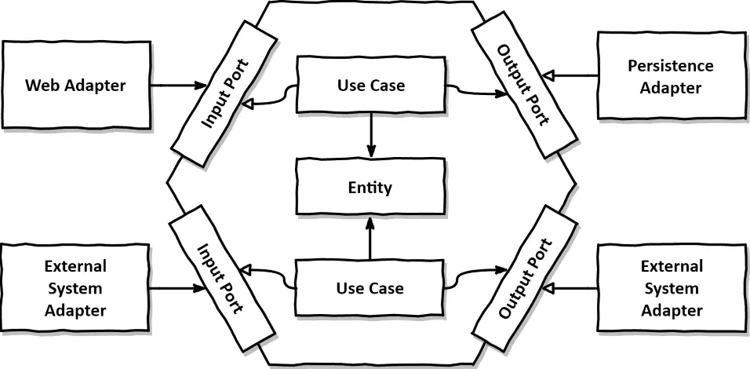

# **Java Project Architecture Template**

<p align="center">
  
</p>

Aqui você deve descrever seu projeto, seu funcionamento e seus objetivos, tornando-o claro para todos. Exemplo:

O **Java Architecture Template** é um projeto criado para servir como modelo na criação de aplicações, visando um desenvolvimento com **qualidade técnica excepcional** para garantir **manutenção a longo prazo**.  
Neste template, fornecemos um **endpoint de cadastro de usuário**, que **dispara um evento no broker** quando um usuário é registrado. Um **listener recebe esses eventos** de criação e os enriquece com dados de endereço.

📚 Leia em:
- 🇬🇧 [English](README.md)


## **Architecture**

Este projeto segue a **Arquitetura Hexagonal**, conforme proposta por **Alistair Cockburn**, focando em **desacoplar a lógica de negócio principal da aplicação de seus mecanismos de entrada e saída**. Esse princípio de design promove **adaptabilidade, testabilidade e sustentabilidade**, encapsulando a camada de aplicação (núcleo de negócio) e expondo portas definidas para interação com sistemas externos.

<p align="center">
    
</p>

### **Core Concept**

A arquitetura isola a lógica central do domínio estruturando a aplicação em camadas distintas:

- **Adapters Layer**: Responsável pela comunicação com sistemas externos (ex.: bancos de dados, APIs ou interfaces de usuário). Dividida em:
  - **Input Adapters**: Lidam com requisições que chegam na aplicação, como requisições HTTP ou eventos.
  - **Output Adapters**: Implementam a comunicação com sistemas externos, como repositórios ou serviços externos.

- **Core Layer**: Representa o núcleo da aplicação:
  - **Domain**: Contém as entidades de negócio principais, objetos de valor e agregados.
  - **Use Cases**: Encapsula os fluxos de trabalho da aplicação e orquestra as interações entre objetos de domínio e portas.
  - **Ports**: Define interfaces para interações de entrada e saída, garantindo que o núcleo permaneça independente de frameworks.

_Read more about: [O Core Domain: Modelando Domínios Ricos](https://medium.com/inside-picpay/o-core-domain-modelando-dom%C3%ADnios-ricos-f1fe664c998f)
and [O Use Case: Modelando as Interações do Seu Domínio](https://medium.com/inside-picpay/o-use-case-modelando-as-intera%C3%A7%C3%B5es-do-seu-dom%C3%ADnio-c6c568270d0c)_

### **Project Structure**

A estrutura segue os princípios da Arquitetura Hexagonal, conforme demonstrado abaixo:

```plaintext
application
    br.com.helpdev.sample
    ├── adapters
    │   ├── input         # Controladores, listeners de eventos ou outros pontos de entrada
    │   ├── output        # Repositórios de banco de dados, clientes de APIs externas, etc.
    ├── config            # Arquivos de configuração e ajustes da aplicação
    ├── core              # Lógica de negócio central
    │   ├── ports
    │   │   ├── input     # Interfaces que definem interações de entrada (ex.: comandos, consultas)
    │   │   ├── output    # Interfaces que definem interações de saída (ex.: persistência, APIs externas)
    │   ├── domain        # Entidades, objetos de valor e agregados
    │   ├── usecases      # Fluxos de trabalho específicos da aplicação
    
acceptance-test
    # Integration tests with real Docker application.
```

### **Architecture Tests**

Esta arquitetura é garantida por meio de testes **ArchUnit**, que validam a conformidade do projeto com os princípios da Arquitetura Hexagonal, assegurando a separação de responsabilidades e a independência da lógica de negócio central em relação aos sistemas externos.

_Read more about: [Garantindo a arquitetura de uma aplicação sem complexidade](https://medium.com/luizalabs/garantindo-a-arquitetura-de-uma-aplica%C3%A7%C3%A3o-sem-complexidade-6f675653799c)_


### **Acceptance Tests**

Para garantir testes robustos, o módulo **acceptance-test** encapsula a aplicação dentro de uma imagem Docker e executa testes de integração em um ambiente que imita de perto o comportamento real da aplicação. Essa abordagem garante a homogeneidade nos módulos da aplicação ao restringir os testes unitários ao módulo principal, enquanto lida com testes de integração separadamente no módulo acceptance-test.
Esta separação garante:

1. **Ambientes de teste realistas**: Os testes de integração são realizados em condições que se assemelham ao ambiente de tempo de execução real, melhorando a confiabilidade
   do teste.

2. **Escopo de teste claro**: Os testes de unidade focam somente em componentes isolados dentro do aplicativo principal, enquanto os testes de integração validam fluxos de trabalho de ponta a ponta
   e interações externas.

3. **Facilidade de implantação**: O encapsulamento no Docker permite a implantação e execução perfeitas de testes em diferentes ambientes.

Ao aderir a essa estratégia, o módulo de teste de aceitação se torna uma parte essencial da manutenção da integridade e confiabilidade do aplicativo
durante seu ciclo de vida. Ver módulo [README](acceptance-test/README.md).

_Leia mais sobre: [Separando os testes integrados de sua aplicação em um novo conceito](https://medium.com/luizalabs/separando-os-testes-integrados-de-sua-aplica%C3%A7%C3%A3o-em-um-novo-conceito-4f511ebb53a4)_


## **Getting Started**

Este projeto fornece uma stack local completa com todas as dependências necessárias para executar o aplicativo. Além disso, está incluido um ambiente de observabilidade
usando **OpenTelemetry** e **Grafana**.

### **Prerequisites**

Certifique-se de ter as seguintes ferramentas instaladas em sua máquina:

- **Docker**: [Install Docker](https://docs.docker.com/get-docker/)
- **Docker Compose**: [Install Docker Compose](https://docs.docker.com/compose/install/)
- **Java 21**: [Download Java 21](https://www.oracle.com/java/technologies/javase/jdk21-archive-downloads.html)

_Observação: o Maven foi incorporado ao projeto para evitar a necessidade de instalá-lo em sua máquina._

### **Running the Project**

Para uma experiência de desenvolvimento perfeita, o projeto inclui um Makefile com comandos predefinidos para simplificar tarefas comuns. Esses comandos encapsulam

1. **Run Tests**:
  - `make run-unit-tests`: Runs unit tests for the application.
  - `make run-acceptance-tests`: Executes acceptance tests using Docker.
  - `make run-all-tests`: Executes all tests, including unit and **integration tests**.

2. **Run Application**:
  - `make mvn-run`: Runs the application with Spring Boot using the `local` profile.

3. **Run Infrastructure**:
  - `make run-infrastructure`: Starts infrastructure services using Docker Compose.
  - `make run-observability`: Starts observability services (OpenTelemetry, Grafana).
  - `make run-stack`: Starts both infrastructure and observability services.

4. **Run Entire Application**:
  - `make run-app`: Starts the application services.
  - `make run-all`: Starts the entire stack (infrastructure, observability, and application).

5. **Stop Services**:
  - `make stop-infra`: Stops infrastructure services.
  - `make stop-observability`: Stops observability services.
  - `make stop-stack`: Stops both infrastructure and observability services.
  - `make stop-app`: Stops the application services.
  - `make stop-all`: Stops all running services (infrastructure, observability, and application).

Esta configuração garante uma experiência de desenvolvimento eficiente e consistente, permitindo integração e monitoramento perfeitos em um ambiente local.

### **The Flyway Database Migration Tool**

Para garantir um melhor desempenho de inicialização e evitar problemas de concorrência em ambientes Kubernetes, o **Flyway** foi implementado como uma ferramenta de migração de banco de dados desacoplada. Este design permite que o processo de migração seja executado de forma independente da aplicação.

Principais Características:

- **Execução Pré-implantação**: Scripts de migração e o comando Flyway estão incluídos em uma imagem Docker, permitindo que sejam executados como um pre-hook durante implantações no Kubernetes ou usando outras estratégias de orquestração.
- **Evitando Contenção**: Ao desacoplar as migrações da inicialização da aplicação, possíveis condições de corrida ou gargalos de recursos são mitigados.
- **Consistência Entre Ambientes**: Garante que todas as migrações de banco de dados sejam aplicadas antes da implantação da aplicação, mantendo a consistência.

Essa abordagem melhora a confiabilidade da implantação e mantém uma separação clara de responsabilidades, alinhando-se aos princípios arquitetônicos do projeto.

Você pode ver um exemplo de como executar em: [arquivo docker-compose da aplicação](.docker-compose-local/application.yaml).

### **OpenAPI**
Este projeto utiliza o **Springdoc OpenAPI** para documentar automaticamente os endpoints REST.

🔗 [Site oficial da OpenAPI](https://swagger.io/specification/)

#### Como acessar a documentação OpenAPI
Após iniciar a aplicação, acesse:

- **Swagger UI**: [http://localhost:8080/swagger-ui.html](http://localhost:8080/swagger-ui.html)
- **Especificação OpenAPI em JSON**: [http://localhost:8080/v3/api-docs](http://localhost:8080/v3/api-docs)

### **AsyncAPI**
Este projeto utiliza o **Springwolf** para documentar eventos assíncronos (Kafka, RabbitMQ, etc.) com **AsyncAPI**.

🔗 [Site oficial da AsyncAPI](https://www.asyncapi.com/)

#### Como acessar a documentação AsyncAPI
Após iniciar a aplicação, acesse:

- **AsyncAPI UI**: [http://localhost:8080/springwolf/asyncapi-ui.html](http://localhost:8080/springwolf/asyncapi-ui.html)
- **Especificação AsyncAPI em JSON**: [http://localhost:8080/springwolf/docs](http://localhost:8080/springwolf/docs)

### **Available Infrastructure**

A stack local também inclui serviços de infraestrutura para dar suporte ao aplicativo. Esses serviços são acessíveis em `localhost` e fornecem funcionalidades
essenciais:

#### Observability Services

Veja a stack: [docker-compose-observability.yaml](.docker-compose-local/observability.yaml)

- **Grafana**: Visualization and monitoring dashboard, available at [http://localhost:3000](http://localhost:3000).
- **Prometheus**: Metrics collection and monitoring system, available at [http://localhost:9090](http://localhost:9090).
- **Jaeger**: Distributed tracing system, available at [http://localhost:16686](http://localhost:16686).

#### Infrastructure Services

Veja a stack: [docker-compose-infrastructure.yaml](.docker-compose-local/infrastructure.yaml)

- **MySQL**: Relational database system, accessible at `localhost:3306`.
- **Kafka**: Event streaming platform, available at `localhost:9092`.

Esses serviços são orquestrados usando o Docker Compose para garantir configuração e operação perfeitas em um ambiente de desenvolvimento local.


## **Architectural Decision Records (ADR)**
O projeto inclui uma pasta dedicada para **Registros de Decisões Arquiteturais (ADR)**, localizada no diretório `docs/adr`. Esta pasta documenta as principais
decisões arquiteturais tomadas ao longo do projeto, fornecendo contexto, justificativa e implicações para essas escolhas.

Para saber mais sobre os ADRs e explorar as decisões documentadas, consulte o [README do ADR](./docs/adr/README.md).


## **Contribua**

Pull Requests são bem-vindos. Para mudanças significativas, por favor, abra uma issue primeiro para discutir o que você gostaria de mudar. Certifique-se de atualizar os testes conforme apropriado.


_**Projeto de Template de Arquitetura proposto por Guilherme Biff Zarelli**_

- **Blog/Site**: [https://helpdev.com.br](https://helpdev.com.br)
- **LinkedIn**: [https://linkedin.com/in/gbzarelli/](https://linkedin.com/in/gbzarelli/)
- **GitHub**: [https://github.com/gbzarelli](https://github.com/gbzarelli)
- **Artigos no Medium**: [https://medium.com/@guilherme.zarelli](https://medium.com/@guilherme.zarelli)
- **Email**: [gbzarelli@helpdev.com.br](mailto:gbzarelli@helpdev.com.br)

_Bom design de software, como Robert C. Martin enfatiza em seu livro *Clean Architecture: A Craftsman's Guide to Software Structure and Design*, visa *
*minimizar os recursos humanos necessários para construir e manter um sistema**. Este template de projeto se inspira em desafios e experiências do mundo real,
fornecendo uma perspectiva abrangente sobre a construção de arquiteturas duráveis e de fácil manutenção._

> *"The only way to go fast, is to go well."*  
> – **Robert C. Martin**
