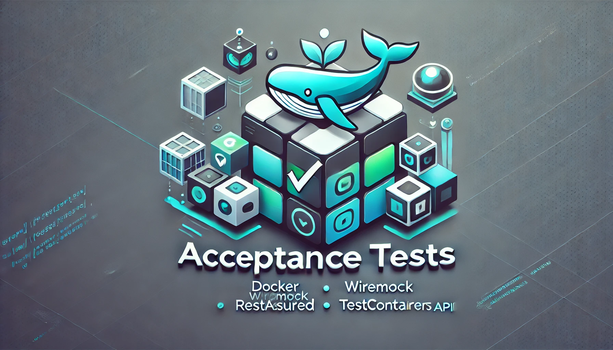

# Acceptance Tests

<p align="center">

</p>

This module is responsible for running black-box acceptance tests against the application by building a Docker image and executing end-to-end validations.

📖 Read this in:
- 🇧🇷 [Português](README.pt.md)

_Read more about acceptance-tests: [Separando os testes integrados de sua aplicação em um novo conceito](https://medium.com/luizalabs/separando-os-testes-integrados-de-sua-aplica%C3%A7%C3%A3o-em-um-novo-conceito-4f511ebb53a4)_

### Advantages:
- **Improved Reliability**: Ensures the application functions correctly in a real-world-like environment.
- **Isolation**: Tests run in a fully contained environment, minimizing dependencies on external systems.
- **Automation**: Enables automated regression testing, reducing manual effort.
- **Scalability**: Can be extended to test different environments and configurations easily.
- **Consistent Results**: Eliminates inconsistencies caused by local setups, leading to more predictable outcomes.

## Features
- **Docker Integration**: Builds the application image and runs tests within a containerized environment.
- **TestContainers**: Sets up necessary dependencies dynamically for the application to run.
- **WireMock**: Mocks external services to ensure controlled and reliable testing.
- **RestAssured**: Simplifies API testing with fluent assertions and validations.
- **JUnit**: Provides the testing framework for executing and reporting results.

## Running the Tests

1. Ensure Docker is running.
2. Run the tests using Maven:
   ```sh
   make run-acceptance-tests
   ```

## Contributing
- Ensure your changes pass all tests before submitting a pull request.
- Follow coding conventions and best practices.

