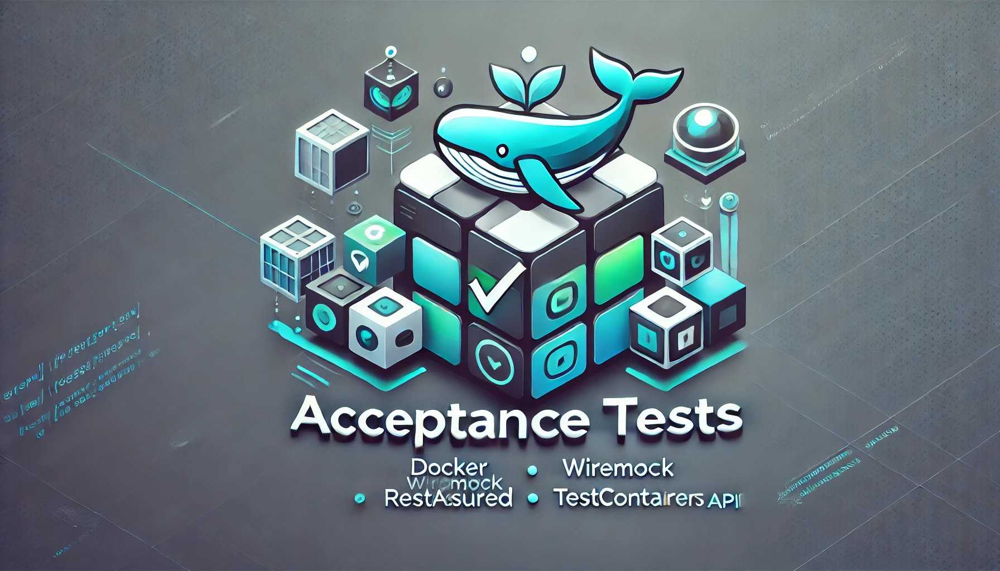

# Testes de Aceitação

<div style="text-align: center;">

</div>

Este módulo é responsável por executar testes de aceitação em caixa preta contra a aplicação, construindo uma imagem Docker e realizando validações ponta a ponta.

📚 Leia em:
- 🇬🇧 [English](README.md)

_Ler mais sobre testes de aceitação: [Separando os testes integrados de sua aplicação em um novo conceito](https://medium.com/luizalabs/separando-os-testes-integrados-de-sua-aplica%C3%A7%C3%A3o-em-um-novo-conceito-4f511ebb53a4)_

### Vantagens:
- **Maior Confiabilidade**: Garante que a aplicação funcione corretamente em um ambiente semelhante ao real.
- **Isolamento**: Os testes são executados em um ambiente totalmente contido, minimizando dependências de sistemas externos.
- **Automatização**: Permite testes de regressão automatizados, reduzindo o esforço manual.
- **Escalabilidade**: Pode ser expandido para testar diferentes ambientes e configurações facilmente.
- **Resultados Consistentes**: Elimina inconsistências causadas por configurações locais, levando a resultados mais previsíveis.

## Funcionalidades
- **Integração com Docker**: Constrói a imagem da aplicação e executa testes dentro de um ambiente conteinerizado.
- **TestContainers**: Configura dinamicamente as dependências necessárias para a execução da aplicação.
- **WireMock**: Simula serviços externos para garantir testes controlados e confiáveis.
- **RestAssured**: Simplifica os testes de API com asserções e validações fluentes.
- **JUnit**: Fornece o framework de testes para execução e geração de relatórios.

## Executando os Testes

1. Certifique-se de que o Docker está em execução.
2. Execute os testes usando Maven:
   ```sh
   make run-acceptance-tests
   ```

## Contribuição
- Certifique-se de que suas alterações passam em todos os testes antes de enviar um pull request.
- Siga as convenções de codificação e boas práticas.

